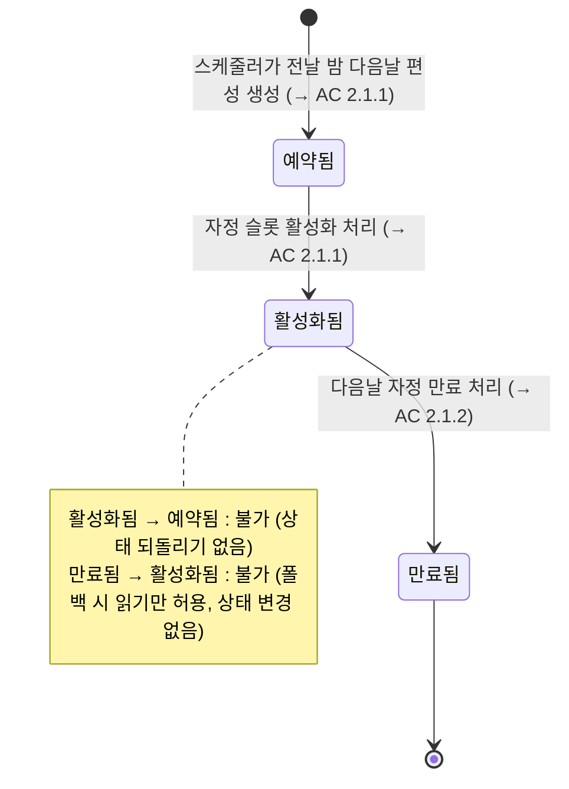
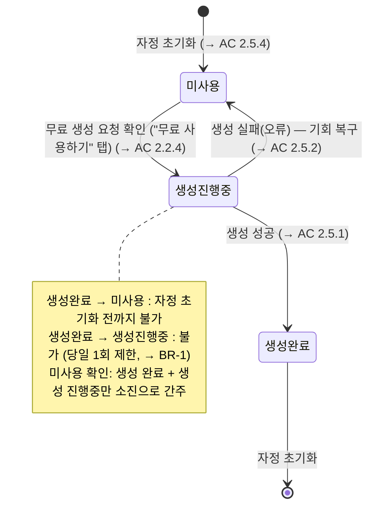
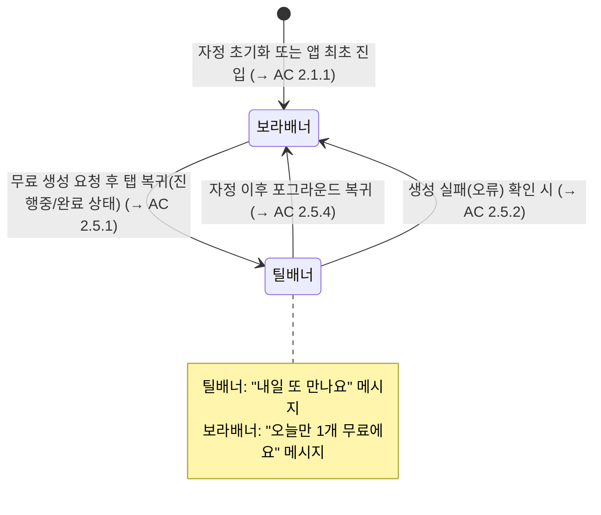

# 무료탭 필터선택 다양화 (x-prd-v2)

## 1. Overview

무료탭 필터선택 다양화: 무료 필터 편성을 하루 1개에서 N개(10개)로 확장하고, 날짜별 편성 관리 구조로 전환하여 사용자의 탐색 동기와 재방문율을 높인다.

---

## 2. User Stories & Acceptance Criteria

### US-1. 사용자는 무료탭에서 오늘의 무료 필터 목록을 탐색하여 생성 의욕을 갖는다

#### AC 2.1.1 — 무료탭 진입 시 N개 필터 그리드 표시

- **Given** 오늘 활성화된 무료 필터 편성이 존재하고, 오늘 무료 생성을 아직 사용하지 않은 상태
- **When** 홈 화면에서 무료 탭을 탭
- **Then** N개 이미지 필터가 2열 그리드로 표시되고, 상단 배너에 "오늘만 1개 무료에요 / 오늘 밤이 지나면 무료 필터가 초기화돼요" 문구(보라 그라데이션)가 노출됨

#### AC 2.1.2 — 필터 편성 폴백 처리

- **Given** 당일 활성화된 슬롯이 없고, 전날 만료된 슬롯이 존재하는 상태
- **When** 무료 탭 진입
- **Then** 전날 슬롯 기준 필터 목록이 표시됨 (빈 화면 없음)

#### AC 2.1.3 — 전체 폴백 실패 시 빈 상태 안내

- **Given** 당일 슬롯도 없고 전날 슬롯도 없는 상태
- **When** 무료 탭 진입
- **Then** "지금은 무료 필터가 없어요" 안내 화면 표시

#### AC 2.1.4 — 무료 기회 남음 레드닷 표시

- **Given** 오늘 무료 생성을 사용하지 않은 상태
- **When** 홈 화면 렌더
- **Then** "무료" 탭 라벨 우측 상단에 레드닷(소형 원형 인디케이터) 표시

---

### US-2. 사용자는 필터 카드를 탭하여 SwipeFeed에서 탐색하고 무료 생성을 완료한다

#### AC 2.2.1 — 그리드 카드 탭 → SwipeFeed(무료 전용) 진입

- **Given** 무료탭 그리드 상태에서 오늘 무료 생성 미사용
- **When** 필터 카드 탭
- **Then** 오늘의 무료 필터만 포함된 SwipeFeed로 이동. 탭한 필터가 첫 화면으로 표시됨. 하단 CTA에 티켓 아이콘과 "무료" 표시

#### AC 2.2.2 — SwipeFeed circular scroll (무한 루프)

- **Given** SwipeFeed 무료 전용 모드 진입 상태
- **When** 마지막 필터에서 아래로 스크롤 / 첫 번째 필터에서 위로 스크롤
- **Then** 각각 첫 번째 / 마지막 필터로 연결(circular). 스냅 전환이 끊김 없이 동작

#### AC 2.2.3 — CTA 탭 → 무료 생성 확인 바텀시트

- **Given** SwipeFeed에서 오늘 무료 생성 미사용 상태
- **When** 하단 CTA 탭
- **Then** "오늘의 무료 기회를 사용할까요? / 하루에 1번만 무료로 만들 수 있어요" 확인 바텀시트 노출. 버튼: "무료 사용하기" / "더 둘러볼게요"

#### AC 2.2.4 — "무료 사용하기" 탭 → 생성 플로우 진행

- **Given** 확인 바텀시트가 노출된 상태
- **When** "무료 사용하기" 탭
- **Then** 서비스 약관 동의 확인 → 사진 접근 권한 확인 → 동시생성 슬롯 여유 확인 → (이미지 가이던스가 있으면) 사진 선택 가이드 바텀시트 → 앨범 피커 → 이미지 크롭 → 무료 생성 요청 → MemeCollection 화면 이동 순으로 진행

#### AC 2.2.5 — "더 둘러볼게요" 탭 → SwipeFeed 유지

- **Given** 확인 바텀시트가 노출된 상태
- **When** "더 둘러볼게요" 탭
- **Then** 바텀시트 닫힘. SwipeFeed 유지, 다른 필터 스크롤 가능

#### AC 2.2.6 — 게스트 유저 생성 시도 → 로그인 유도

- **Given** 미로그인 상태에서 SwipeFeed CTA 탭
- **When** "무료 사용하기" 진행
- **Then** 로그인 유도 바텀시트 → 로그인 완료 후 생성 플로우 재개

#### AC 2.2.7 — 중복 요청 방지

- 생성 요청 처리 중 연속 탭 시 첫 번째 요청만 처리

#### AC 2.2.8 — 사진 선택 / 크롭 취소 → SwipeFeed 복귀

- 사진 선택 또는 크롭 단계에서 취소 시 → SwipeFeed 복귀, CTA 유지

#### AC 2.2.9 — 동시생성 슬롯 초과

- 동시생성 슬롯 초과 시 → "밈 생성 중에는 다른 밈을 만들 수 없어요!" 토스트

#### AC 2.2.10 — 자정 경계 처리

- 서버에서 생성 시점 기준으로 무료 슬롯 재검증

#### AC 2.2.11 — 무료 생성 요청 실패 → 오류 안내 표시

- **Given** 무료 생성 요청이 진행 중인 상태
- **When** 서버 오류로 생성 요청 실패
- **Then** 오류 유형에 따라 적절한 안내 표시. 해당 실패는 무료 기회 미소진 처리 (→ BR-2 참조)

---

### US-3. 사용자는 SwipeFeed에서 무료 필터를 자유롭게 탐색하며 마음에 드는 필터를 선택한다

#### AC 2.3.1 — SwipeFeed 내 상하 스크롤 탐색

- 위/아래 스크롤 → 전체화면 스냅 전환으로 다음/이전 무료 필터 표시. 각 필터마다 동일한 CTA

#### AC 2.3.2 — SwipeFeed에서 그리드로 복귀

- 뒤로가기 → 무료탭 그리드 화면으로 복귀

---

### US-4. 사용자는 탭 이탈 후 재진입 시 이전 탐색 위치에서 이어서 탐색한다

#### AC 2.4.1 — 탭 재진입 시 스크롤 위치 복원

- **Given** 무료탭 그리드를 스크롤하다가 다른 탭으로 이동한 후
- **When** 무료탭 재진입
- **Then** 이전 스크롤 위치에서 이어서 표시됨 (위치 초기화 없음)

---

### US-5. 무료 생성 완료 후 재진입한 사용자에게 내일 재방문을 유도한다

#### AC 2.5.1 — 생성 완료 후 틸 배너로 전환

- 생성 완료(진행중/완료) 후 무료탭 복귀 → **틸 배너(초록 그라데이션)** + "내일 또 만나요 / 내일 새로운 필터로 찾아올게요"

#### AC 2.5.2 — 생성 실패 시 보라 배너 유지

- 생성 실패(오류) 시 **보라 배너** 유지 — 무료 기회 재사용 가능

#### AC 2.5.3 — 레드닷 소멸

- 무료 생성 성공 직후 홈 화면 렌더 시 **레드닷 즉시 소멸**

#### AC 2.5.4 — 앱 포그라운드 복귀 시 상태 갱신

- 앱 포그라운드 복귀 시 자정 넘김 확인 → 필터 목록 및 사용 상태 갱신(보라 배너 + 레드닷 복구)

---

### US-6. 무료 생성 완료 후에도 동일 필터를 유료로 생성할 수 있다

#### AC 2.6.1 — 사용 완료 후 필터 그리드 유지

- 사용 완료 후 필터 그리드 정상 노출 — 딤 처리 또는 숨김 없음

#### AC 2.6.2 — 사용 완료 상태 SwipeFeed — 유료 CTA 표시

- 사용 완료 상태 SwipeFeed → CTA에 코인 아이콘과 유료 가격 표시

#### AC 2.6.3 — 유료 CTA 탭 → 크레딧 안내 바텀시트

- 유료 CTA 탭 → **"크레딧을 사용할까요? / 오늘의 무료 기회를 이미 사용했어요"** 바텀시트. 버튼: "크레딧 사용하기" / "취소"

#### AC 2.6.4 — "크레딧 사용하기" 탭 → 유료 생성 플로우

- "크레딧 사용하기" 탭 → 기존 유료 생성 플로우 진행

#### AC 2.6.5 — 다른 기기에서 무료 기회 차단

- 기기 A에서 무료 사용 완료 → 기기 B에서 시도 시 서버에서 유료 가격 적용

---

### US-7. 무료탭 외 진입점(추천탭 등)에서도 동일한 무료 생성 경험을 제공한다

#### AC 2.7.1 — 추천탭 등 외부 진입점 — 동일 확인 바텀시트

- 추천탭 등 외부 진입점에서 오늘 무료 미사용 시 → 동일한 확인 바텀시트 노출

#### AC 2.7.2 — 외부 진입점 "더 둘러볼게요" → 현재 피드 유지

- 추천탭 SwipeFeed에서 "더 둘러볼게요" → 현재 탭의 알고리즘 피드 유지(무료탭 피드로 전환하지 않음)

#### AC 2.7.3 — 외부 진입점 — 사용 완료 상태 유료 CTA

- 외부 진입점에서 사용 완료 상태 → AC 2.6.3과 동일하게 크레딧 안내 바텀시트 노출

---

## 3. State Machine

### 3.1 날짜별 무료 필터 슬롯 상태

### 3.2 사용자 일별 무료 생성 기회 상태

### 3.3 무료탭 배너 상태

---

## 4. Business Rules

- **BR-1. 1일 1회 무료 생성 제한**
  오늘 어떤 무료 필터든 생성을 시작(진행 중 포함)하면 → 해당 날짜에 무료 기회 소진. 무료 필터가 N개여도 1회만 무료. 나머지는 유료 가격 적용 → AC 2.6.1~2.6.4 참조
- **BR-2. 생성 실패는 무료 기회 미소진**
  생성 요청이 오류 상태로 종료된 경우 → 해당 시도를 무료 기회 사용으로 간주하지 않음. 재시도 가능 → AC 2.5.2 참조
- **BR-3. DB 레벨 중복 생성 방지**
  동일 유저가 동일 날짜에 무료 생성 중복 시도 → DB 고유 제약으로 두 번째 시도 차단. 차단된 요청은 유료 가격으로 폴백 후 "이미 무료 기회를 사용했어요" 안내
- **BR-4. 이미지 단일 입력 필터만 무료 편성 가능**
  조합 필터, 영상 필터는 무료 편성 대상에서 제외
- **BR-5. 테마별 편성 비율**
  아기 테마 3개, 반려동물 테마 3개, 인물/스튜디오 테마 4개 = 총 10개 (설정 가능). 각 테마 풀에서 랜덤 선정하되, **직전 7일 (설정 가능) 이내 편성된 필터는 제외**하여 다양성 확보 → AC 2.1.1 참조
- **BR-6. 그리드 순서 = SwipeFeed 순서 고정 동기화**
  슬롯 배정 시 순서 인덱스 랜덤 배정 후 고정. 배정 후 변경 불가
- **BR-7. 스케줄러 폴백 순서**
  당일 편성 실패 → 전날 만료 슬롯 유지 → 전날도 없으면 → 이미지 타입 필터 중 편성 횟수 최소 순으로 테마 비율(3-3-4)을 유지하며 자동 채움. **어떤 상황에서도 무료 필터 0개 상태 불허** → AC 2.1.2, 2.1.3 참조
- **BR-8. 스케줄러 실행 순서**
  ① 오늘 예약 슬롯 활성화 → ② 어제 활성 슬롯 만료 → ③ 내일 편성 예약 생성. 각 단계 독립 에러 격리
- **BR-9. 스케줄러 멱등성 보장**
  동일 크론 2회 실행에도 중복 슬롯 생성 안 됨(이미 활성화/예약된 슬롯은 스킵)
- **BR-10. 서버 선배포 원칙**
  DB 마이그레이션 → 서버 배포 → 앱 배포 순서. 앱 먼저 배포 시 오늘 무료 사용 여부 플래그 부재로 배너 정상 동작 불가
- **BR-11. 구앱 하위 호환 — 기존 1개 필터 경험 유지**
  업데이트 전 구버전 앱은 기존 1개 필터 경험을 그대로 유지. 서버 응답에 신규 필드가 추가되어도 구앱은 무시하여 파싱 에러 없음 (graceful degradation). 버전 기준선 미만 앱에는 서버가 필터 1개만 반환
- **BR-12. 서버가 생성 시점에 슬롯 자동 매핑**
  앱은 슬롯 식별자를 전달하지 않음. 서버가 필터 정보와 오늘 날짜로 자동 조회·연결
- **BR-13. 필터 목록 API에 오늘 무료 사용 여부 포함**
  앱이 이 값으로 배너 색상, CTA 아이콘, 레드닷 표시 여부 결정
- **BR-14. 추천탭 필터 풀 — 무료 필터 포함 유지**
  추천탭 그리드/피드는 무료 편성 필터를 포함하여 노출됨. 추천 알고리즘에서 무료 필터를 별도 제외하지 않음. 추천탭에서 무료 필터를 발견한 경우 → US-7 흐름(확인 바텀시트) 동일 적용 → US-7, AC 2.7.1 참조
- **BR-15. 무료 생성 시 크레딧 선차감 없음**
  무료 생성 요청 시 크레딧 선차감 발생하지 않음 (0원 처리). 1회 무료 기회 사용 완료 후 동일 날짜의 추가 생성은 유료 가격으로 크레딧 차감 적용 (무료로 잘못 간주하여 0원 처리 금지) → BR-1, BR-2 참조
- **BR-16. 날짜 경계 기준 시간대 — KST(UTC+9)**
  자정(00:00) 기준 무료 기회 초기화, 슬롯 활성화/만료, 생성 시점 검증 등 모든 날짜 경계 처리는 KST(UTC+9) 기준으로 동작 → AC 2.2.10, 2.5.4, BR-8 참조

---

## 5. 3-Tier Boundary

### ALWAYS (자동 실행)

- 서버가 생성 시점에 필터 정보와 오늘 날짜로 해당 무료 슬롯을 자동 조회·연결 (앱이 슬롯 식별자 전달 불필요)
- 1일 1회 무료 체크는 **DB 레벨 고유 제약**으로 보장 (레이스 컨디션으로 인한 중복 무료 생성 원천 차단)
- 스케줄러 단계별 에러 격리 — 슬롯 활성화 / 만료 처리 / 다음날 예약 생성을 각각 독립 실행하여 한 단계 실패가 전체를 중단시키지 않음
- 스케줄러 실패 시 즉시 **Slack/Datadog 알림** 발송 (수동 개입 감지용)
- SwipeFeed 진입 시 그리드에서 이미 받은 필터 목록 재사용 (추가 API 호출 없음)
- 탭 스크롤 위치 복원 구현 시 무료탭과 추천탭 모두 동일 방식으로 함께 적용 (공통 인프라 변경)
- 구앱 하위 호환 유지 — 응답 구조 변경 없이 신규 필드만 추가
- 서버 배포 완료 확인 후 앱 배포 진행

### ASK (PM 확인 필요)

- 무료 생성 시 차감 크레딧 수치의 외부 분석 시스템 로깅 포함 여부 — 팀 내 재화 관련 외부 로깅 정책 확인 필요 (**Bob**)
- 어드민에서 특정 날짜에 특정 필터를 수동 편성할 수 있는 기능 필요 여부 — 운영팀 워크플로우 확인 필요 (**Jayla**)
- 기존 필터 176개에 테마 태그(아기/반려동물/인물) 일괄 부착 방법 — MongoDB 직접 업데이트 vs 어드민 API vs 팩토리 일괄 기능 중 팀 선호 방식 확인 (**Bob/Jayla**) ⚠️ **블로커: 서버 배포 전 완료 필수**
- Retool에서 관리하던 무료 필터 칩 진열 기능의 실제 사용 여부 확인 — 사용 중이면 대체 방안 마련 후 제거, 미사용이면 레거시로 즉시 제거 (**Jayla**)
- 티켓(무료 생성권) 아이콘 에셋 — 앱·CDN 모두 미존재. Figma에서 export 후 CDN 업로드 필요. **Owen** 담당 여부 확인

### NEVER DO (금지)

- 필터별 무료 사용 여부 체크 사용 금지 → 반드시 유저 전체 기준 글로벌 체크 사용 (필터별 체크 시 N개 필터를 N번 무료 생성하는 허점 발생)
- 앱이 슬롯 식별자를 생성 요청에 포함하는 방식 금지 — 서버가 자동 매핑하는 구조 유지
- 무료 생성 완료 후 필터를 그리드/SwipeFeed에서 제거·숨김 처리 금지 → 유료 가격으로 계속 노출해야 함
- 생성 실패(오류) 상태를 무료 기회 소진으로 처리 금지 (재시도 허용)
- 조합 필터·영상 필터를 무료 편성 대상에 포함 금지
- SwipeFeed 진입 시 필터 목록 추가 API 호출 금지 (그리드 응답 데이터 재사용)
- 배너·푸시 문구에 "여러 개", "골라보세요" 등 복수형 표현 사용 금지 (기대 불일치 발생)

---

## 6. Out of Scope

- **Task 2** (이후 몇일간 필터 예고 + 알림 등록): 본 태스크 이후 단계. 예고 필터 노출로 인해 그리드 콘텐츠가 증가하면 카테고리 칩 추가를 재검토
- **Task 3** (아기/강아지/내 사진 테마 이미지 페르소나): 본 태스크 이후 단계
- **카테고리 필터 칩** (애기/동물/스튜디오 필터링): 10개 필터는 한 화면에 노출 가능하여 Task 1에서는 불필요. Task 2 이후 재검토
- **스케줄러 재시도 크론** (실패 후 5분 뒤 자동 재시도): v2에서 추가. v1은 수동 개입으로 대응
- **웹 대응**: 앱 전용 기능. 웹 fallback 없음
- **Slack 발송**: PRD 공유는 PM이 직접 처리

---

## 후속 작업

- **기능 구현**: 본 PRD 기반 코드 개발
- **이벤트 로그**: 구현 완료 후 별도 레이어에서 작업
- **A/B 실험**: 구현 완료 후 `/ab-test` 스킬로 실험 세팅
